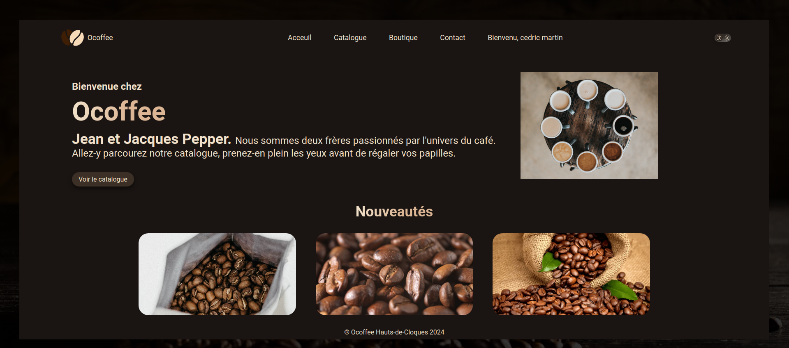

# O'Coffee

## Information du projet

[Le projet](./docs/demande-client/01.project.md)

## Remarques pédagogiques et rendus

[Recommandations](./docs/recommandations/)

## un aperçu du rendu
> #  DataBase

## Pour tester ce projet il vous faut
> #  postgresql
---
## Install From Package.json
* `npm i`

## Fichier environemment
* `un fichier .env`
* `fichier example fournie à la racine du projet`

## Install PostgreSQL
* `sudo apt update`
* `sudo apt install postgresql postgresql-contrib`
* `sudo service postgresql start [stop, status, reload, restart]`

## Run Server in Dev
* `npm run dev`

## Start Postgres Shell
* `sudo -i -u postgres psql`
* `pass= root`

## Set user
* `CREATE USER le_nom_de_l_utilisateur WITH PASSWORD 'le_mot_de_passe';`

## Basic Postgres Commands
* `\q`: Quit
* `\c` __database__: Connect to a database
* `\d` __table__: Show table definition including triggers
* `\dt` *.*: List tables from all schemas (if *.* is omitted will only show SEARCH_PATH ones)
* `\l`: List databases
* `\dn`: List schemas
* `\df`: List functions
* `\dv`: List views
* `\timing`: Show query timing stats
---
> ## Built with
this project was built in: `Nodejs`, `ejs`, `Express`, `PostgreSQL`, `dotenv`
